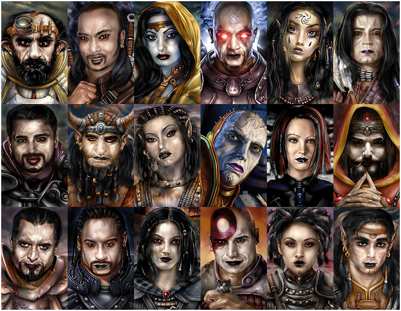

<h1></a>Baldur's Goth Portraits Collection</h1>

<h3>A Spellhold Studios mod for Baldur's Gate, Baldur's Gate II, IWD (original and EE games), 
IWD2, Tutu, Baldur's Gate Trilogy and EET<h3>

 

**Author:** MajorTomSawyer  
**Mod Forum:** <a href="http://www.shsforums.net/forum/269-baldurs-goth/">Spellhold Studios</a>  

## 

 

 

## 

:page_facing_up: [Read the mod's readme](https://spellholdstudios.github.io/readmes/baldur_goth-readme-english.html) | [Français](https://spellholdstudios.github.io/readmes/baldur_goth-readme-french.html)

:inbox_tray: [Download the mod at Spellhold Studios](http://www.shsforums.net/files/category/30-baldurs-goth/) 

## 

<a href="#intro">Overview</a> &#8226; <a href="#compat">Compatibility</a> &#8226; <a href="#installation">Installation</a> &#8226; <a href="#credits">Credits and Acknowledgements</a> &#8226; <a href="#versions">Version History</a> 

## Overview

This mod is a collection of NPCs portraits gathering the Baldur's Both mods series that attempted to make Baldur's Gate and Baldur's Gate II more 'Gothy'. It gathers in one single package the following mods:

1. <a href="http://www.shsforums.net/files/file/82-baldurs-goth/">Baldur's Goth II</a>: This mod offers alternative portraits for each of the BioWare Baldur's II NPCs, including Jon Irenicus, and Sarevok for ToB. It also edits their paperdolls, as well as a new startup screen for both SoA and ToB.
2. <a href="http://www.shsforums.net/files/file/887-baldurs-goth-for-tutu-v3/">Baldur's Goth for Tutu</a>: This mod offers alternative portraits for each of the BioWare Baldur's II NPCs who also appear in BG1 (E	Edwin, Imoen, Jaheira, Minsc and Viconia). It also edits their paperdolls, as well as a new startup screen for both BG and TotSC.
3. <a href="http://www.shsforums.net/files/file/85-bgt-baldurs-goth/">Baldur's Goth for Tutu/BGT</a>: This mini-mod offers alternative portraits for a few NPC mods characters (Fabio from The Secret of Bonehill, Indira, Mur'Neth, Mulgrave and Xavia). It also edits their paperdolls.
4. <a href="http://www.shsforums.net/files/file/480-cross-goth/">Cross Goth</a>: This mod offers alternative portraits for a few NPC mods characters (Allison, Chloe, Goo, Kitanya, Kiyone, Kova, v, Sheena the Half-dragon, and Wikaede), to make them fit in more with the Bioware NPCs if you are playing with the original Baldur's Goth mod. It also edits their paperdolls.
5. <a href="http://www.shsforums.net/files/file/481-baldurs-goth-expansion-project-beta/">Baldur's Goth Expansion Project</a>: Made at the request of many players, this mod offers more alternative 'gothy' portraits for each of the BioWare Baldur's II NPCs.

This new version makes all additional custom portraits also available for assignment to your Player Character (PC).

 

